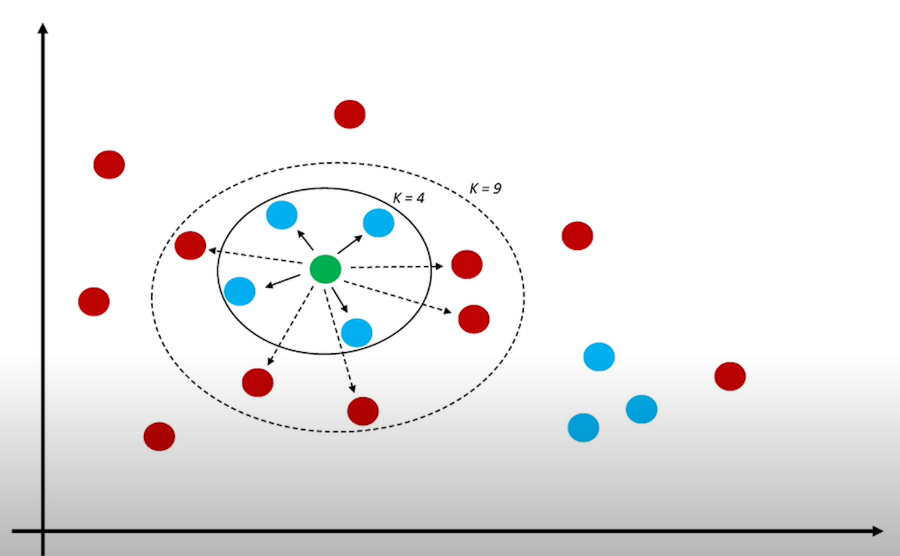
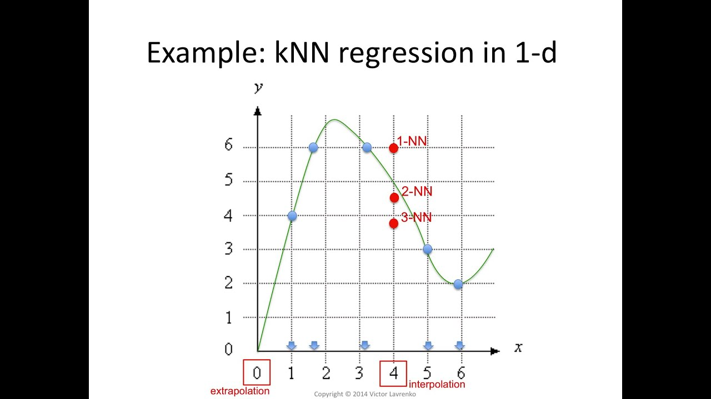

# K-Nearest Neighbors (KNN)

## Clasificación con KNN

K-Nearest Neighbors (KNN) es uno de los algoritmos de aprendizaje automático más utilizados en la industria debido a su simplicidad y eficacia. KNN es un algoritmo no paramétrico, lo que significa que no hace suposiciones sobre la distribución de los datos. En lugar de hacer suposiciones, KNN aprende directamente de los datos. KNN es un algoritmo de aprendizaje supervisado que se puede utilizar tanto para clasificación como para regresión.

Básicamente, KNN funciona de la siguiente manera: dado un conjunto de datos de entrenamiento, para cada muestra a predecir, KNN encuentra las muestras de entrenamiento más cercanos a él y asigna la etiqueta de clasificación más común entre ellas.

Por ejemplo, en la siguiente imagen, KNN con K=3 asignaría la etiqueta de clasificación "triángulo rojo" al punto de prueba verde porque de las 3 muestras más cercanas a él, la mayoría, dos, son triángulos rojos. Sin embargo, si K=5, KNN asignaría la etiqueta de clasificación "cuadrado azul" al punto de prueba.

En la siguiente imagen podemos ver cómo se generaría la superficie de decisión de un clasificador KNN con diferentes valores de K.

Este algoritmo no "aprende", **no se entrena ni se fijan valores de parámetros internos**. Simplemente se utiliza el conjunto de datos como "base de conocimiento" y se hacen las predicciones sobre dicha base. Esto puede ser un inconveniente, pues **cada vez que hay que hacer una predicción, se utiliza todo el dataset, y esto requiere de memoria y recursos de procesamiento importantes**.

Así, el "entrenamiento" es muy ligero ya que consiste solo en almacenar los datos de entrenamiento. Sin embargo, la predicción es muy costosa computacionalmente, ya que hay que calcular la distancia de cada punto de prueba a todos los puntos de entrenamiento. Por tanto, **KNN es un algoritmo lento y no es adecuado para conjuntos de datos grandes**.

## Regresión con KNN

En el caso de regresión, KNN asigna el promedio de los valores de los puntos de entrenamiento más cercanos al punto de prueba. En la siguiente imagen, podemos ver el valor que se asignaría al punto x=4 para K=1, K=2 y K=3:

