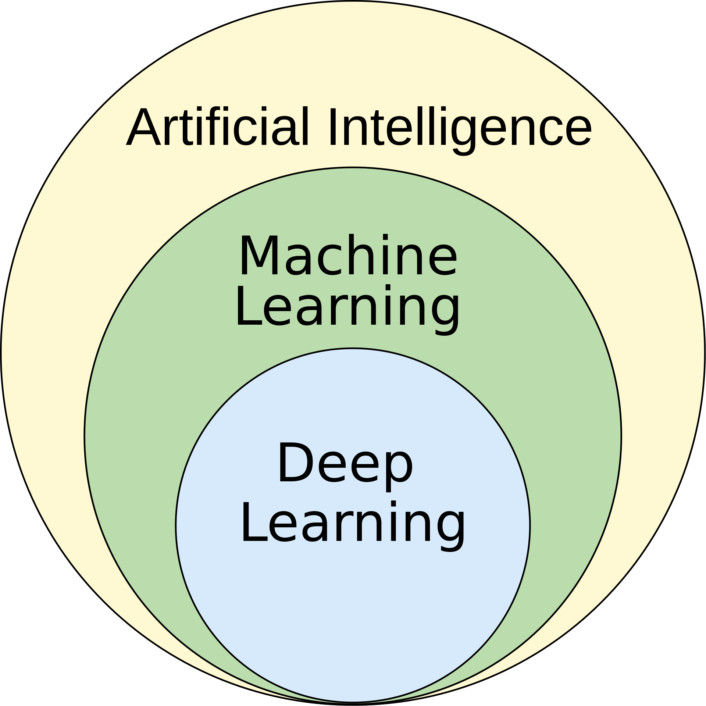

# Introducción a *Machine Learning*

## Definición

### *Machine Learning* vs. Inteligencia Artificial

El concepto de Inteligencia Artificial tiene muchas definiciones y su uso ha ido evolucionando a lo largo del tiempo. A menudo usado como sinónimo, ***machine learning* o aprendizaje automático**, puede ser más fácil de definir.

El término pone el énfasis en el **aprendizaje** y podríamos establecer la diferencia en que el ***machine learning*** se utiliza para resolver problemas para los cuales los humanos no somos capaces de desarrollar algoritmos por nosotros mismos. En lugar de simplemente programar un algoritmo que resuelve el problema, la máquina aprende a descubrir su propio algoritmo, sin necesidad de que se les diga explícitamente.

El *machine learning* dota a los sistemas de la capacidad de aprender de los datos con los que se entrena el modelo, identificar patrones y tomar decisiones con mínima intervención humana. A diferencia de la **IA tradicional, donde los programas se diseñan con reglas explícitas**, el **ML construye modelos aprendiendo a partir de datos**, y cuanto más datos se le proporcionan, más aprende y mejor es el **modelo** que construye.

En los años 90 aparece la primera aplicación realmente popular de *machine learning*: el **filtro de spam**. En los últimos años, ha dado lugar a una revolución en la visión por computador, el reconocimiento de voz, el procesado de lenguaje natural (***Natural Language Processing*, NLP**), la conducción autónoma y muchos otros campos.

Un par de definiciones clásicas son las siguientes:

> [El aprendizaje automático es el] campo de estudio que da a los ordenadores la capacidad de aprender sin ser programados explícitamente.
>
> — Arthur Samuel, 1959

> Se puede decir que un programa aprende de la experiencia E con respecto a una tarea T y una medida de rendimiento P, si su rendimiento en T, medido por P, mejora con la experiencia E.
>
> — Tom Mitchell, 1997

<!-- TODO: Dependencia e interacción con Big Data -->

### *Deep Learning*

El ***Deep Learning*, o aprendizaje profundo**, es una subdisciplina del aprendizaje automático que ha ganado un auge histórico en la última década gracias al incremento en la capacidad de procesamiento del hardware (GPGPU) que ha permitido utilizar **redes neuronales artificiales** con muchas capas (el término "profundo" hace referencia a la profundidad de la red, es decir, al número de capas que tiene).	

A diferencia de los métodos de aprendizaje automático tradicionales, el *deep learning* se basa en arquitecturas compuestas por múltiples capas de neuronas artificiales que pueden capturar patrones complejos y jerárquicos en grandes cantidades de datos. Esto ha permitido resolver tareas antes inalcanzables, como el reconocimiento de imágenes a nivel humano y el procesamiento avanzado de lenguaje natural.

## Modelos

> [Modelos para entender una realidad caótica | DotCSV](https://www.youtube.com/watch?v=Sb8XVheowVQ)

Un modelo es una descripción articulada y abstracta de una realidad. es una representación de un sistema que se utiliza para comprenderlo y predecir su comportamiento.

En *machine learning*, los modelos son los que **entrenamos** con datos basándonos en uno u otro algoritmo de aprendizaje. Básicamente el *machine learning* aprende modelos a base de ajustarse a una gran cantidad de ejemplos. Son los que se utilizan para predecir la respuesta correcta cuando se le da un nuevo conjunto de datos de entrada con los que pretenderemos predecir la salida.

## Paradigmas de aprendizaje / Clasificación según la supervisión del aprendizaje

> [¿Qué es el Aprendizaje Supervisado y No Supervisado? | DotCSV](https://www.youtube.com/watch?v=oT3arRRB2Cw)

> [Sistemas de aprendizaje automático: supervisado, no supervisado](https://openwebinars.net/academia/aprende/fundamentos-inteligencia-artificial/21829/#)

### Aprendizaje supervisado (*supervised learning*)

Se da cuando el conjunto de datos de entrenamiento está **etiquetado con la respuesta correcta**. El algoritmo de aprendizaje recibe un conjunto de datos de entrenamiento y, sabiendo la respuesta correcta para cada uno, infiere el modelo que genera esa respuesta para esos datos.

#### Clasificación

Una tarea típica de aprendizaje supervisado es la **clasificación**: si pensamos en el caso del spam, un algoritmo puede aprender examinar muchos **ejemplos de correos electrónicos que ya han etiquetados como spam y no spam**, infiriendo, por ejemplo que ciertas palabras son casi siempre spam y que los correos electrónicos que provienen determinados email no son nunca spam. De este modo, cuanto más se entrene el algoritmo (cuantos más ejemplos de emails etiquetados se le den), mejor será su capacidad para filtrar el spam.

Otro ejemplo de clasificación sería el reconocimiento de dígitos escritos a mano, donde el algoritmo recibe imágenes de dígitos escritos a mano y debe clasificarlas en los dígitos del 0 al 9.
Tipos de clasificación:

- **Binaria**: cuando la salida es de dos clases (spam/no spam, positivo/negativo, etc.).
- **Multiclase**: cuando la salida es de más de dos clases (reconocimiento de dígitos, clasificación de imágenes, etc.).
- **Multietiqueta**: cuando la salida puede tener más de una etiqueta (por ejemplo, etiquetando música en géneros).

#### Regresión

En los problemas de **regresión**, el objetivo es predecir un **valor continuo**. Por ejemplo, predecir el precio de una casa en función de sus características, como el número de habitaciones, el tamaño del jardín, la ubicación, etc. En estos casos, en lugar de tener cada ejemplo etiquetado con una clase (spam o no spam, el dígito que se corresponde a la imagen, foto de perro o foto de gato) como en la clasificación, cada ejemplo tiene una etiqueta numérica (el precio de la casa, que puede ser cualquier número real).

### Aprendizaje no supervisado (*unsupervised learning*)

En el aprendizaje no supervisado, el conjunto de datos de entrenamiento no está etiquetado con la respuesta correcta. Su objetivo es descubrir patrones en los datos. Por ejemplo, se puede utilizar para agrupar los datos de entrada en grupos, lo que se conoce como **clustering**.

#### Clustering

Un ejemplo de *clustering*  es la segmentación de clientes en grupos de clientes similares para adaptar mejor los productos y servicios a cada grupo. Esa segmentación puede utilizarse para sistemas de recomendación, marketing, etc.

#### Minería de asociaciones

Mientras que el *clustering* agrupa instancias (como clientes o productos) en grupos basándose en la similitud de sus características, la minería de reglas de asociación se centra en descubrir relaciones o patrones de co-ocurrencia entre elementos (por ejemplo, identificar que cuando se compra pan, también se compra mantequilla).

#### Reducción de la dimensionalidad (*dimensionality reduction*)

Otro ejemplo de aprendizaje no supervisado es la **reducción de la dimensionalidad**, que consiste en reducir el número de variables de un conjunto de datos. Por ejemplo, si tenemos un conjunto de datos con muchas variables, algunas de las cuales pueden ser redundantes o irrelevantes, podemos utilizar técnicas de reducción de la dimensionalidad. Esto se utiliza típicamente antes de aplicar un algoritmo supervisado, para reducir el tiempo de entrenamiento y mejorar la precisión del modelo.

El caso más común de reducción de la dimensionalidad es el análisis de componentes principales (***principal component analysis*, PCA**), que es una técnica que transforma un conjunto de datos en un conjunto de variables no correlacionadas llamadas componentes principales.

#### Detección de anomalías

Se centra en identificar puntos o patrones inusuales que se desvían significativamente del comportamiento normal del conjunto de datos. Se emplean en áreas como la detección de fraudes, la monitorización de sistemas y la seguridad, al marcar como anómalos datos que podrían indicar errores, ataques o comportamientos inesperados.

### Aprendizaje por refuerzo (*reinforcement learning*)

En el aprendizaje por refuerzo, el algoritmo de aprendizaje, llamado **agente**, aprende mediante refuerzos y castigos. El agente recibe un entorno y realiza acciones en el entorno. El entorno devuelve un refuerzo o castigo al agente, dependiendo de si la acción fue beneficiosa o perjudicial para el agente. El objetivo del agente es maximizar el refuerzo total que recibe del entorno.

Múltiples ejemplos se encuentran en robótica (enseñando a un robot a caminar) o en juegos (enseñando a un ordenador a jugar al ajedrez).
