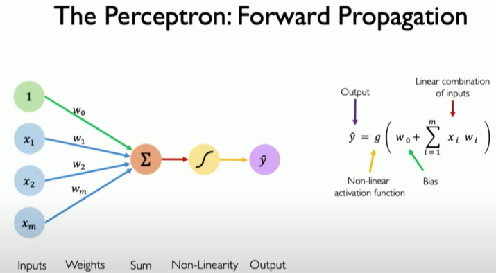
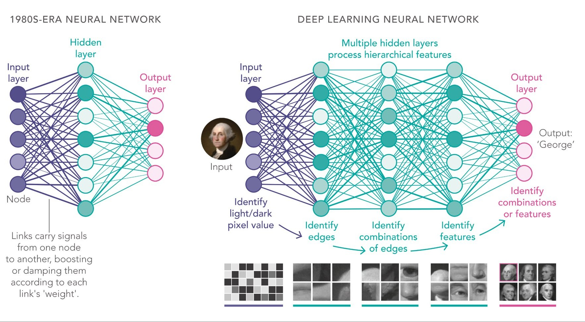

# Redes Neuronales y Deep Learning

## Historia: Hitos Fundamentales

### Primeras redes neuronales y desarrollos fundamentales (1943-2011)

- 1943: McCulloch y Pitts proponen el primer modelo matemático de una neurona.
- 1958: Frank Rosenblatt desarrolla el **Perceptrón**, considerado la primera red neuronal implementada.
- 1969: Minsky y Papert publican "Perceptrons", donde demuestran las limitaciones del perceptrón simple, lo que provoca el "invierno de la IA".
- 1986: Hinton, Rumelhart y Williams publican el algoritmo de ***backpropagation***, que **permite entrenar redes neuronales multicapa**.
- 1988: LeCun et al. presentan el primer modelo de red neuronal convolucional para el reconocimiento de caracteres manuscritos (MNIST).
- 1997: Hochreiter & Schmidhuber introducen las **LSTM** (Long Short-Term Memory), fundamentales para el procesamiento de secuencias y series temporales.

### El Boom de la IA (2012-presente)

- Causas: 
    - Aumento de la capacidad de cómputo (GPUs, TPUs)
    - Disponibilidad de enormes conjuntos de datos (Internet, Big Data)
    - Avances en algoritmos y arquitecturas de redes
    - Gran incremento de la financiación e inversión industrial

- Hitos principales:
    - 2012: **AlexNet** (Krizhevsky, Sutskever e Hinton) reduce el error en **ImageNet** al 15.3% (antes 26%), demostrando el poder de las CNNs y marcando el inicio del boom.
    - 2014: **DeepFace** de Facebook alcanza precisión casi humana (97.35%) en reconocimiento facial.
    - 2014: Ian Goodfellow introduce las **GANs** (Generative Adversarial Networks), revolucionando la generación de contenido.
    - 2015: **ResNet** de Microsoft Research introduce conexiones residuales, permitiendo entrenar redes de más de 100 capas.
    - 2016: **AlphaGo** de DeepMind derrota al campeón mundial Lee Sedol, redes neuronales profundas entrenadas mediante aprendizaje supervisado y por refuerzo con técnicas avanzadas de búsqueda de árboles Monte Carlo.([Documental](https://www.youtube.com/watch?v=WXuK6gekU1Y)).
    - 2017: Aparece la arquitectura **Transformer** con la publicación de "**Attention is all you need**" por Google Brain, transformando el procesamiento de lenguaje.
    - 2018: **BERT** de Google establece nuevos récords en comprensión de lenguaje natural.
    - 2020: **GPT-3** de OpenAI demuestra capacidades emergentes en modelos de lenguaje a gran escala.
    - 2021: Los **modelos de difusión** (DALL-E, GLIDE) comienzan a dominar la generación de imágenes realistas.
    - 2022: **ChatGPT** (GPT-3.5) de OpenAI populariza los asistentes conversacionales.
    - 2023: **GPT-4o** de OpenAI y proliferación de modelos **multimodales** (texto, imagen, audio, video).
    - 2024: Primeros modelos con capacidades avanzadas de razonamiento (**OpenAI o1**).
    - 2025: **DeepSeek-R1** (*open-weights*) baja el coste de los modelos de lenguaje con un rendimiento similar al de o1.


## El Perceptrón: La Neurona Artificial

El perceptrón es la unidad fundamental de una red neuronal, inspirado en el funcionamiento básico de una neurona biológica.

> [¿Qué es una Red Neuronal? Parte 1 : La Neurona | DotCSV](https://www.youtube.com/watch?v=MRIv2IwFTPg&list=PL-Ogd76BhmcC_E2RjgIIJZd1DQdYHcVf0&index=7)
  
> [ChatGPT is made from 100 million of these [The Perceptron]](https://www.youtube.com/watch?v=l-9ALe3U-Fg)

### Estructura del Perceptrón

[](https://aiml.com/what-is-a-perceptron/)

Un perceptrón consta de:
1. **Entradas (*inputs*)**: Valores numéricos (x₁, x₂, ..., xₙ)
2. **Pesos (*weights*)**: Valores que determinan la importancia de cada entrada (w₁, w₂, ..., wₙ)
3. **Sesgo (*bias*)**: Un término adicional (w₀) que permite ajustar el umbral de activación
4. **Función de suma ponderada**: z = w₁x₁ + w₂x₂ + ... + wₙxₙ + w₀
5. **Función de activación**: Transforma la suma ponderada (ej. escalón, sigmoide, ReLU)
6. **Salida (output)**: El resultado final después de aplicar la función de activación


### Funcionamiento Matemático

La operación del perceptrón se puede expresar como:

$$ y = g(\sum_{i=1}^n w_ix_i + w_0)$$

donde g es la función de activación.

### Limitaciones del Perceptrón Simple

El perceptrón simple solo puede resolver problemas linealmente separables, como operaciones lógicas AND y OR, pero fracasa con XOR, lo que llevó al primer declive en la investigación de redes neuronales.

### Implementación Básica en PyTorch

```python
import torch
import torch.nn as nn
import torch.optim as optim

class Perceptron(nn.Module):
    def init(self, input_size):
    super(Perceptron, self).init()
        self.linear = nn.Linear(input_size, 1) # Una capa lineal
        self.activation = nn.Sigmoid() # Función de activación sigmoide
    def forward(self, x):
        x = self.linear(x)
        x = self.activation(x)
        return x
```

## Redes Neuronales Multicapa (MLP)

Para superar las limitaciones del perceptrón simple, surgieron las redes neuronales multicapa.

> [3Blue1Brown - But what is a neural network?](https://www.youtube.com/watch?v=aircAruvnKk&list=PLZHQObOWTQDNU6R1_67000Dx_ZCJB-3pi)

### Estructura de una Red Neuronal Multicapa


Una red neuronal multicapa contiene:
1. **Capa de entrada**: Recibe los datos iniciales
2. **Capas ocultas**: Realizan transformaciones internas
3. **Capa de salida**: Produce el resultado final

Sin embargo, normalmente se cuentan las capas ocultas y la de salida, pero no la de entrada, ya que esta no tiene parámetros que aprender, simplemente sirve para introducir los datos.

### ¿Por qué necesitamos capas ocultas?

Las capas ocultas permiten aprender características más complejas y no lineales de los datos, posibilitando resolver problemas que un perceptrón simple no puede.

### Implementación de una MLP en PyTorch

```python
class MLP(nn.Module):
    def __init__(self, input_size, hidden_size, output_size):
        super(MLP, self).__init__()
        self.layer1 = nn.Linear(input_size, hidden_size)
        self.activation1 = nn.ReLU()
        self.layer2 = nn.Linear(hidden_size, output_size)
        self.activation2 = nn.Sigmoid()
        
    def forward(self, x):
        x = self.layer1(x)
        x = self.activation1(x)
        x = self.layer2(x)
        x = self.activation2(x)
        return x
```

## Funciones de Activación

Las funciones de activación son cruciales para introducir no-linealidades en el modelo.

### Principales Funciones de Activación

1. **Sigmoide**: σ(x) = 1/(1+e^(-x))
   - Rango: (0, 1)
   - Uso: Clasificación binaria, capas de salida

2. **Tangente Hiperbólica (tanh)**: tanh(x) = (e^x - e^(-x))/(e^x + e^(-x))
   - Rango: (-1, 1)
   - Uso: Capas ocultas, cuando necesitamos valores negativos

3. **ReLU (Rectified Linear Unit)**: ReLU(x) = max(0, x)
   - Rango: [0, ∞)
   - Uso: Estándar en muchas arquitecturas modernas
   - Ventaja: Computacionalmente eficiente, reduce el problema de desvanecimiento del gradiente

4. **Leaky ReLU**: f(x) = max(αx, x), donde α es un valor pequeño (ej. 0.01)
   - Ventaja: Evita neuronas "muertas" presentes en ReLU

5. **Softmax**: Convierte un vector de valores en probabilidades (suma 1)
   - Uso: Clasificación multiclase

## Entrenamiento: **Descenso de Gradiente**

> [¿Qué es el Descenso del Gradiente? Algoritmo de Inteligencia Artificial | DotCSV](https://www.youtube.com/watch?v=A6FiCDoz8_4)

> [3Blue1Brown - Gradient descent, how neural networks learn](https://www.youtube.com/watch?v=IHZwWFHWa-w&list=PLZHQObOWTQDNU6R1_67000Dx_ZCJB-3pi&index=2)

El entrenamiento de una red neuronal busca encontrar los pesos y sesgos óptimos para minimizar una función de pérdida.

### Función de Pérdida (Loss Function)

La función de pérdida cuantifica qué tan bien está funcionando nuestro modelo. Las más comunes son:
- **Error Cuadrático Medio (MSE)**: Para regresión
- **Entropía Cruzada (Cross-Entropy)**: Para clasificación

### Descenso de Gradiente

El descenso de gradiente es un algoritmo de optimización que actualiza iterativamente los parámetros en dirección opuesta al gradiente de la función de pérdida.

1. **Conceptos clave**:
   - **Gradiente**: Vector que indica la dirección de máximo crecimiento de una función
   - **Tasa de aprendizaje (*learning rate*)**: Controla el tamaño de los pasos durante la optimización

2. **Proceso**:
   - Calcular la predicción (*forward pass*)
   - Calcular la pérdida comparando la predicción con el valor real
   - Calcular el gradiente de la pérdida respecto a cada parámetro
   - Actualizar los parámetros: θ = θ - η∇J(θ)
     donde η es la tasa de aprendizaje y ∇J(θ) es el gradiente

3. **Variantes**:
   - **Descenso de Gradiente por Lotes (*Batch Gradient Descent*)**: Usa todo el conjunto de datos
   - **Descenso de Gradiente Estocástico (SGD)**: Usa una muestra aleatoria cada vez
   - ***Mini-batch Gradient Descent***: Usa pequeños lotes aleatorios de datos

## ***Backpropagation***

La retropropagación o *backpropagation* es el algoritmo que permite entrenar redes neuronales de múltiples capas de manera eficiente.

> [¿Qué es una Red Neuronal? Parte 3 : Backpropagation | DotCSV](https://www.youtube.com/watch?v=eNIqz_noix8&list=PL-Ogd76BhmcC_E2RjgIIJZd1DQdYHcVf0&index=10)

> [3Blue1Brown - Backpropagation](https://www.youtube.com/watch?v=Ilg3gGewQ5U&list=PLZHQObOWTQDNU6R1_67000Dx_ZCJB-3pi&index=3)

### ¿Cómo funciona?

1. **Forward Pass**: Calcula la salida de la red para una entrada dada
2. **Cálculo de Error**: Compara la salida con el valor objetivo
3. **Backward Pass**: Propaga el error hacia atrás, desde la salida hacia la entrada
4. **Actualización de Pesos**: Ajusta los pesos utilizando la regla de la cadena del cálculo diferencial

### La Regla de la Cadena en Backpropagation

> [3Blue1Brown - Backpropagation calculus](https://www.youtube.com/watch?v=tIeHLnjs5U8&list=PLZHQObOWTQDNU6R1_67000Dx_ZCJB-3pi&index=4)

La clave matemática detrás de backpropagation es la regla de la cadena, que permite calcular gradientes en redes de múltiples capas:

∂L/∂w = ∂L/∂y × ∂y/∂z × ∂z/∂w

donde:
- L es la función de pérdida
- y es la salida de la neurona
- z es la suma ponderada de las entradas
- w es el peso a actualizar

### Entrenamiento en PyTorch

PyTorch maneja automáticamente el cálculo de gradientes y la actualización de parámetros:

```python
# Definir el modelo, función de pérdida y optimizador
model = MLP(input_size=2, hidden_size=5, output_size=1)
criterion = nn.BCELoss()  # Binary Cross Entropy
optimizer = torch.optim.Adam(model.parameters(), lr=0.001, betas=(0.9, 0.999))

# Loop de entrenamiento
for epoch in range(1000):
    # Forward pass
    outputs = model(inputs)
    loss = criterion(outputs, targets)
    
    # Backward pass y optimización
    optimizer.zero_grad()  # Reiniciar gradientes
    loss.backward()        # Calcular gradientes
    optimizer.step()       # Actualizar parámetros
```

## ***Deep Learning***

El *deep learning* se refiere a redes neuronales con múltiples capas ocultas que pueden aprender representaciones cada vez más abstractas.



### Ventajas del Deep Learning

1. **Aprendizaje automático de características**: No requiere ingeniería manual de características
2. **Capacidad para modelar relaciones complejas**: Especialmente útil en datos no estructurados
3. **Transferibilidad**: Los modelos pueden transferir conocimiento entre tareas

### Arquitecturas Populares de Deep Learning

1. **Redes Neuronales Convolucionales (CNNs)**: 
   - Especializadas en procesamiento de imágenes
   - Utilizan capas de convolución para detectar patrones espaciales

2. **Redes Neuronales Recurrentes (RNNs) y LSTM/GRU**: 
   - Diseñadas para secuencias y datos temporales
   - Mantienen un estado interno o "memoria"

3. **Transformers**: 
   - Arquitectura basada en atención para secuencias
   - Base de modelos como BERT y GPT

4. **Redes Generativas Adversarias (GANs)**:
   - Dos redes que compiten entre sí (generador vs discriminador)
   - Utilizadas para generar contenido nuevo (imágenes, texto, etc.)

5. **Autoencoders**: 
   - Comprimen datos en representaciones más pequeñas y luego los reconstruyen
   - Útiles para reducción de dimensionalidad y detección de anomalías

## Consideraciones prácticas y desafíos

### Regularización

Técnicas para prevenir el *overfitting*:
1. **Dropout**: Desactiva aleatoriamente neuronas durante el entrenamiento
2. **Regularización L1/L2**: Penaliza pesos grandes
3. **Batch Normalization**: Normaliza las activaciones

```python
class RegularizedMLP(nn.Module):
    def __init__(self, input_size, hidden_size, output_size, dropout_prob=0.5):
        super(RegularizedMLP, self).__init__()
        self.layer1 = nn.Linear(input_size, hidden_size)
        self.bn1 = nn.BatchNorm1d(hidden_size)  # Batch Normalization
        self.dropout = nn.Dropout(dropout_prob)  # Dropout
        self.activation = nn.ReLU()
        self.layer2 = nn.Linear(hidden_size, output_size)
        
    def forward(self, x):
        x = self.layer1(x)
        x = self.bn1(x)
        x = self.activation(x)
        x = self.dropout(x)
        x = self.layer2(x)
        return x
```

### Optimizadores Avanzados

PyTorch ofrece varios optimizadores más sofisticados que el SGD básico:

1. **Adam**: Combina momentum y adaptación de tasas de aprendizaje
2. **RMSprop**: Ajusta las tasas de aprendizaje utilizando promedios móviles
3. **Adagrad**: Adapta las tasas de aprendizaje por parámetro

```python
# Ejemplo con optimizador Adam
optimizer = torch.optim.Adam(model.parameters(), lr=0.001, betas=(0.9, 0.999))
```